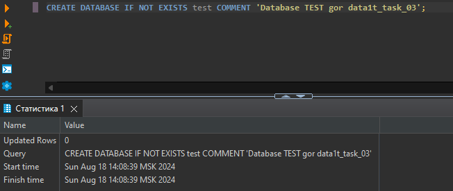

# Итоговая аттестация Задание 3.


## Создание Docker-контейнера с ClickHouse и SQL

## Цель:
Научиться разворачивать ClickHouse в Docker, создавать базы данных и настраивать роли с разными правами доступа с помощью SQL-запросов через DBeaver.

## Описание задания:

- Создайте директорию для проекта и необходимые файлы.
- В файле docker-compose.yml опишите конфигурацию для запуска контейнера с ClickHouse.
- Если у вас еще не установлен DBeaver, скачайте и установите его.
- В DBeaver, используя SQL-редактор, выполните SQL-запрос для создания базы данных test.
- Аналогично создайте базу данных main.
- В базе данных main создайте роль с правами на чтение.
- Создайте роль с правами на запись в БД main.
- Для проверки создайте пользователя, назначьте ему одну из созданных ролей и сделайте простой запрос к БД, подтверждающий, что роль работает корректно. Сделайте скриншот.

## Результат задания
После выполнения задания у вас будет:
- Развернутый в Docker ClickHouse, 
- Две базы данных (test и main) 
- Настроенные роли для управления доступом к базе данных main. 
- Вы можете подключаться к ClickHouse через DBeaver и выполнять SQL-запросы для настройки прав доступа.

## Выполнение
- Создание docker-compose.yml файла и открытие порта
- Исправление конфига users.xml для возможности создания пользователей

- Подключение к ClickHouse через DBeaver

- В DBeaver, используя SQL-редактор, выполните SQL-запрос для создания базы данных test.
```CREATE DATABASE IF NOT EXISTS test COMMENT 'Database TEST for data1t_task_03';```

- Аналогично создайте базу данных main.
```CREATE DATABASE IF NOT EXISTS main COMMENT 'Database TEST for data1t_task_03';```

- В базе данных main создайте роль с правами на чтение.
```CREATE ROLE r_read; GRANT SELECT ON main.* TO r_read; GRANT SHOW ON main.* TO r_read;```

- В базе данных main создайте роль с правами на запись.
```CREATE ROLE r_write; GRANT INSERT ON main.* TO r_write;```

- Для проверки создайте пользователя, назначьте ему одну из созданных ролей и сделайте простой запрос к БД, подтверждающий, что роль работает корректно. Сделайте скриншот.
```CREATE USER user_read IDENTIFIED WITH PLAINTEXT_PASSWORD BY 'pass1'; GRANT r_read TO user_read;```

- Для проверки создадим соединение user_write и сделаем запросы

- Запрос на вставку данных для пользователя user_write

- Запрос на выборку данных для пользователя user_write

- Для проверки создадим соединение user_read и сделаем запросы

- Запрос на вставку данных для пользователя user_read

- Запрос на выборку данных для пользователя user_read

